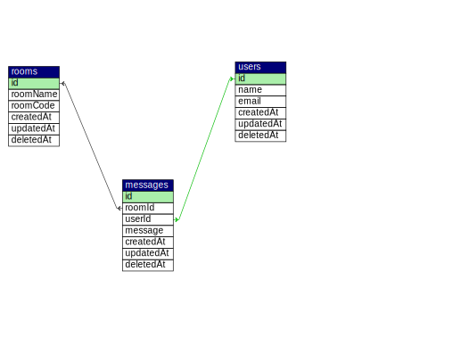

# Group Chat API

This is the RESTful API of the group chat.

## Installation 

- Make sure you had clone this repo
- Copy environment from `.env.example` to `.env`
- Configure your `.env` file according to your MySQL credentials
- Open your terminal in this project and run 

	```bash
	npm install
	```

## How To Run This RESTful API

- Create The group chat Database

	```bash
	CREATE DATABASE group-chat CHARACTER SET utf8 COLLATE utf8_general_ci;
	```

- Run On Development

	```bash
	npm run dev
	```

- Run On Production

	```bash
	npm run build
	```

	```bash
	npm start
	```

## Entity Relationship Diagram (ERD)

[](erd.svg)

## API SPECS

- POST `/api/v1/auth/join` Route for joining to a chat room

	Request Body

	```
	{
		"name": "your name",
		"email": "your email",
		"roomCode": "your roomCode"
	}
	```

- PUT `/api/v1/auth/room/:id` Route for changing the room name

	Request Body

	```
	{
		"roomName": "your roomName"
	}
	```
- POST `/api/v1/auth/access-token` Route for generate the access token

	Request Body

	```
	{
		"refreshToken": "your refresh token"
	}
	```
- POST `/api/v1/message` Route for sending message

	Request Body

	```
	{
		"roomId": "your roomId",
		"message": "your message"
	}
	```

- GET `/api/v1/message` Route for fecthing all messages by room id

	Request Queries

	```
	{
		"roomId": "your roomId",
		"limit": "your limit",
		"page": "your page"
	}
	```

- DELETE `/api/v1/message/:id` Route for removing the message

## License
[MIT](https://choosealicense.com/licenses/mit/)